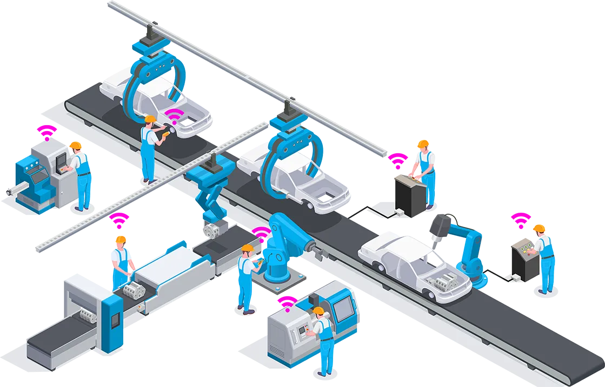

# Getting Started

The Wittra IoT solution lets you connect low-power wireless devices
to the cloud, to obtain positioning and sensing data.
Our solution combines multiple technologies, and as such, is able
to fullfill the needs of a wide range of applications in one system.
Read more on [this page](products-wittra-solution.md).

This user documentation will get you started and provide you with the
information you need on the Wittra products & technologies.

## Getting Started

To get started, follow these steps:
1. [Create a project](howto-portal.md)
2. [Register your devices](howto-device-registration.md)
3. [Set up your Gateway](products-gateway.md)
4. [Update your devices](howto-system-update.md)

You are now ready to explore!
A good starting point may be the various "How to" guides linked from the left menu.
There is plenty to choose from, from [deployment](howto-deployment-guide.md)
to [integration & API](howto-integrations-and-api.md) and includnig [map setup](howto-set-up-map.md)
or [device configuration](howto-device-configuration.md).

> Information in this document is subject to change without notice and does
> not represent a commitment on the part of Wittra. Wittra provides this
> document "as is", without warranty of any kind, expressed or implied,
> including, but not limited to, the implied warranties of fitness or
> merchantability for a particular purpose. Wittra may make improvements and/or
> changes to the manual, product(s), and/or the software described in this
> manual at any time. See [legal](resources-legal.md) for legal documents.
