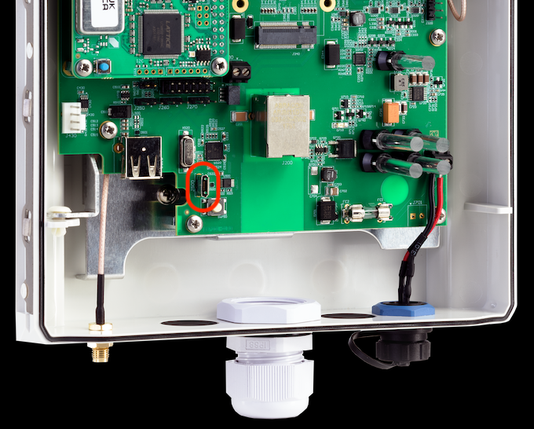

# Advanced Gateway Settings

This page presents a few advanced features of the Gateway.

## Accessing Configuration Files

The Gateway has a configuration folder that can be mounted as a USB drive on
your computer.

On the Unified Gateway, you will need a USB-A to USB-Micro-B cable to connect
the device to your computer.

On the legacy Gateway, you will need a USB-A to USB-C cable to connect
the device to your computer.

> WARNING! The Gateway cannot be powered by the 12 V
> Power Supply when connecting the USB-C cable to the Raspberry Pi,
> because this can damage the USB port of the computer!

> **NOTE**: You need to provide the USB-A to USB-C cable yourself.

> **NOTE:** A USB-C to USB-C cable will not work according to
> raspberrypi.org. If the computer doesn’t have a USB-A connection,
> you need to use a USB-C/USB-A adapter.

To mount the USB drive, follow the steps below:

1. Power-cycle the Gateway (unplug power supply if already plugged, then plug back).
2. Connect the USB adapter with the USB-A end to a computer and the other end to the Gateway.
3. Wait for the Unified Gateway to boot. It can take up to 10 minutes.
4. A virtual USB flash drive will be mounted and show up in the device
   list on your computer.
5. Open the USB flash drive.

Once you are done editing the configuration files, unmount the USB drive as follows:
1. Safely eject/unmount the virtual USB flash drive.
2. Unplug the USB adapter.

## Changing Security Settings

It is possible to update the DTLS keys in your network, for instance
if you need to replace a Gateway or want to set up cross-site roaming.

> **NOTE:** You will need to manually update all the devices in the network
> after updating security settings, to propagate the change.

To update the DTLS key, you will need to edit a configuration file, as
described in [Accessing Configuration Files](#Accessing-Configuration-Files).

Once you have mounted the USB drive, open `security.txt` and follow
the guidelines already present in the file.

Once done, safely unmount the drive then **proceed to a manual update of all
C{x}ameleon devices**.

Read more about our [secure-by-design approach](technologies-security.md).

### Roaming

You can enable roaming between two or more networks, *as long as these networks are strictly beyond range of each other*.
To enable roaming, Copy the `security.txt` file from gateway A and replace the `security.txt` file in gateway B with this copy.
Run a manual update of all devices to ensure they have the correct security settings.

## Static IP setup

When you are connecting the gateway to a network that does not use
DHCP you will need to change the default network settings of the
gateway.

To update the DTLS key, you will need to edit a configuration file, as
described in [Accessing Configuration Files](#Accessing-Configuration-Files).

Once you have mounted the USB drive, open `ethernet_conf.txt` and follow
the guidelines in the file. Generally, you will want to set at least
the `ipv4` and `nameservers` options. Proceed then to safely unmount the drive.
