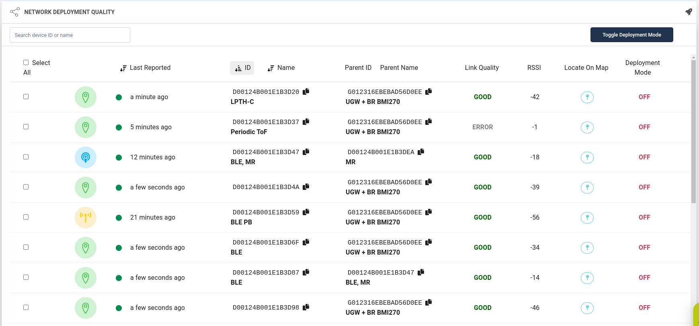

# Deployment Guide

This guide will help you deploy the infrastructure of your system so you can start using your IoT Solution from Wittra.
The infrastructure is the fixed part of the network that enables connectivity:
* The Gateway -- *Mioty and 6LoWPAN*
* Mesh-routers (MRs) -- *6LoWPAN only*
* Positioning beacons (PBs) -- *6LoWPAN only*

## Power

Bear in mind you will need to go to the site and confirm there is mains power available for the Gateway, Mesh-routers, and Positioning Beacons.
It is feasible to use MRs and PBs on external battery power, but this will eventually require battery replacement/recharging.

## Outdoor use and weatherproofness

The C{x}ameleon is weatherproof, when it has the USB connector cover on,
as well as when equipped with [LPTH or LPTH-C](products-lpth-lpthc.md) + cover on.

If you set up the gateway or mains-powered C{x}ameleon devices
outdoors (typically: Mesh-Routers and Positioning Beacons) they need to
be protected from different weather conditions, for example under a rain cover
(such as under the eaves of a building).

The Gateway on the other hand is primarily intended for indoor use. For outdoor
use, it must be placed in a box that protects it physically from both
malicious agents (the Gateway is a **trusted device**) and from precipitations.

The temperature ranges for our devices are specified in the respective product
datasheets.

## General deployment rules

A Golden Rule to follow is to install all infrastructure devices high up if feasible and in "clear air", meaning as
far as possible from large metal objects and surfaces (e.g. metal poles, metal beams, sheet metal, etc.). If it is impossible to
avoid these types of objects, the Wittra device will still function but the effective communication distance might be reduced
in some directions.

To maximize the range of the Gateway, it is possible to use an extension coaxial cable (RG-58/U with SMA connector)
and place the antennas up to 5m higher than the device.

Below are guidelines for outdoor and indoor use, with reference numbers for spacing between devices.
If there are obstructions (trees, buildings) between the devices then you might need to reduce
the distances. The quality of the radio
links can be seen in the Wittra portal so it is easy to check this during installation.

#### Outdoors
* Place all infrastructure devices **at least 3m above ground level** to maximize range.
* Space Gateway and MRs 100m - 200m apart.
* Space PBs no more than 100m apart, and 100m - 200m from the nearest MR/Gateway (PBs need mesh connectivity).

#### Indoors
* Place all infrastructure devices **high up** on the floor they are in.
* Space Gateway and MRs 30m - 100m apart.
* Space PBs no more than 50m apart, and 30m - 100m from the nearest MR/Gateway (PBs need mesh connectivity).

## Planning your deployment

There are two separate considerations when planning the network:
1. Placing the Mesh-Routers (MRs) in optimal locations to enable routing of data from WiTTRA Sense 360 tags to the Gateway;
2. Placing Positioning Beacons (PBs) in optimal locations to capture signals from the WiTTRA Sense 360 tags for positioning.

Place MRs within the site in a way that any location where tracking/sensing is required has MRs or the Gateway within reach (30-200m depending on the environment, see "General rules" above).
Ensure that there exist at least one or more multi-hop paths (for redundancy, multiple paths are preferred) from any point to the Gateway via MRs.

You can then proceed and place PBs following the boundaries of your site, then add more in the middle, to form a grid with 50-100m spacing ("General considerations").

## Deploying your infrastructure

The following steps describe the setup process for network infrastructure, assuming you already [have a running Gateway](howto-gateway-setup.md).

**Step 1: Install MRs and PBs**

Deploy now all MRs and PBs as planned in the step above.
**Important:** follow guidelines in the "General deployment rules" section above, and be sure to externally power MRs and PBs.

**Step 2. Check connectivity**

Check the link quality status under the `Network` tab in the [Wittra portal](https://portal.wittra.se).
- Your deployment will be visible under `Network deployment quality`, but please note that it could take between five to ten minutes before the deployment data is visible.
  It will be updated in real-time as new network data is received.
- The table lists all the MRs and PBs in the deployment along with deployment data (their parent, the link quality between them, and when they were last seen).

- Below the table is the network tree depicting the network topology in a graphical way.

The link quality between each device and its parent should be *GOOD* or *OK* at least.
The RSSI values are also shown in the table to get a better understanding of the link quality.
`RSSI` should ideally be above `-90dbm`.

**Step 3. Fix connectivity (if necessary)**

If the indicator shows *BAD/ERROR*, move the device in question closer to the Gateway or its
closest Mesh-Router and repeat Step 2.

> **NOTE:** Radio range and link quality depends on multiple parameters, for
> example, physical obstructions (like walls, metal frames, building materials,
> etc.), radio and electronic interference from other appliances, etc.

The devices in your network can now start sending data!
