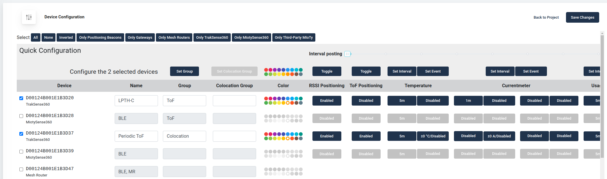

# Device Configuration

You can onfigure your devices by selecting the devices you want to configure under the the `Devices` tab and clicking *Manage*.

> **NOTE:** MiotySense360 devices always require a manual update to propagate any new configuration
> (All other device types, on the other hand, are able to fetch configuration automatically over 6LoWPAN).

## *Name* and *Group*

You can configure a *Name* and a *Group* for any device (including the Gateway), for easier identification.
A group can be used when filtering devices on the map in the `Visualization` tab.

## Positioning: 2D + floor identification
To enable positioning, first of all, you need to plan your site with Positioning Beacons
and Mesh-Routers to cover the area of interest. See how in our [Deployment Guide](howto-deployment-guide.md).

For tracking, your device must be configured as a WiTTRA Sense 360.
The device can be positioned via two technologies: RSSI and ToF.
Simply enable/disable each individually with the *toggle* buttons.
You can choose to have only RSSI, only ToF, or both enabled for any single device.

We also support floor positioning, with barometric pressure as an indicator of height.
For floor positioning, you need the following:
* [Set up the map](howto-set-up-map.md) with the floors you need to cover
* Positioning Beacon: equip with an [LPTH-C click-on](products-lpth-lpthc.md) and enable periodic (@30 minutes) posting of barometric pressure
* WiTTRA Sense 360: equip with an [LPTH click-on](products-lpth-lpthc.md) and enable posting of barometric pressure along with any positioning event

Read more on the [Positioning Page](technologies-positioning.md).
Some of the functionality is not available yet in the Portal, so, feel free to
contact [support@wittra.se](mailto:support@wittra.se) for any help setting up floor positioning!

## Sensing
To configure periodic posting for your devices, go to the manage view, select the devices, then choose
"Set Interval" for the sensor you wish to configure.
See example below for posting internal temperature at a 5 minutes interval.

The C{x}ameleon also supports event-based posting, but we are still working to enable that
from the Portal. Reach out at [support@wittra.se](mailto:support@wittra.se) for any assistance
with event posting.

## Impact detection
The C{x}ameleon has several inbuilt sensors, one of which is a low-power 3D
accelerometer. This device measures acceleration in 3 axes, including the earth’s gravitational
acceleration towards the ground.

Use cases might include detecting accidental damage to goods or assets (e.g. dropped boxes
or collision of forklifts), measuring the g-force of certain industrial processes (e.g.
the impact force of a piston to know that it is operating within tolerance) among others.

The accelerometer in the C{x}ameleon can accurately measure up to ±16g on a wide range of
objects, provided the tag is firmly attached to the object. *Note that multiple impact
events might be detected if the object does not completely stop in the initial impact.*

It is even possible to filter one or more desired axes of impact (e.g. detect only impact in
the X and Y plane), or to universally detect impact in all directions.

## Advanced configuration

The devices can be configured to post any sensor data on complex conditions, such as:
* Post air pressure, accelerometer values, or sensor data after any position update.
* Post temperature and humidity when the temperature exceeds a threshold.
* etc.

Advances configuration is not available yet in the portal but we can help you set it up.
Contact [support@wittra.se](mailto:support@wittra.se) if this is what you need.
