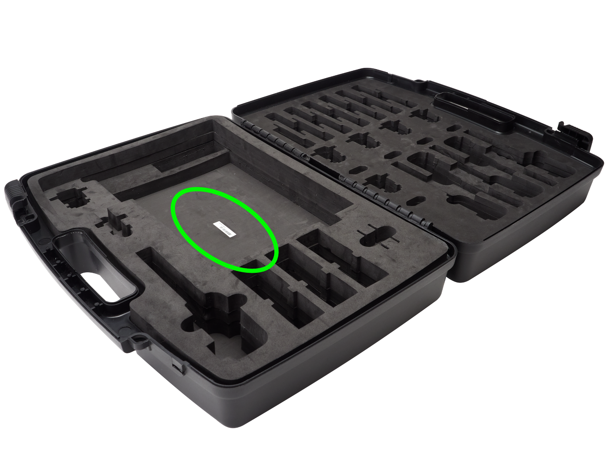
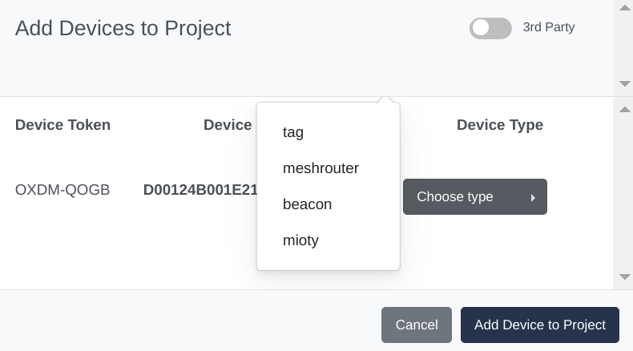
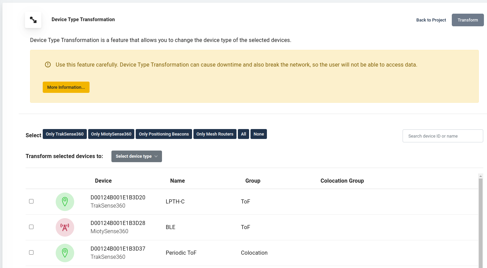

# Register & Convert Devices

This page shows how to add your [C{x}ameleon](products-cxameleon.md) devices
to a project, select a device type for them, and re-configure them at
a later stage.
Before you start, be sure you [have your project ready](howto-portal.md) in the Wittra portal.

## Device Registration

You will need to enter your batch token to register
your devices. The batch token is printed on a sticker inside your WiTTRA™
IoT out of the Box (see picture below), or inside your C{x}ameleon box.

For each C{x}ameleon device, select a device type.

## Device Type Transformation

The C{x}ameleon device can change type even after their initial registration.
This enables you to match your needs without having to replace any hardware.
Select the device(s) you want to convert and choose their new type.

**Warnings about device transformation:**
- The transformation is not instantaneous. Your devices will be automatically updated within a few hours
(depending on the network size). To speed up this process, you can restart the devices or perform a manual update.
- Removing a Mesh-Router may affect connectivity and positioning.
- Removing a Positioning Beacon may affect positioning.
- Removing a MiotySense360 requires a manual update.
- Adding MiotySense360 requires a manual update.
- New Mesh-Routers require connecting the device to a power source.
- New Positioning Beacon requires connecting the device to a power source.
- Upon transformation, the device will lose any earlier configuration.
