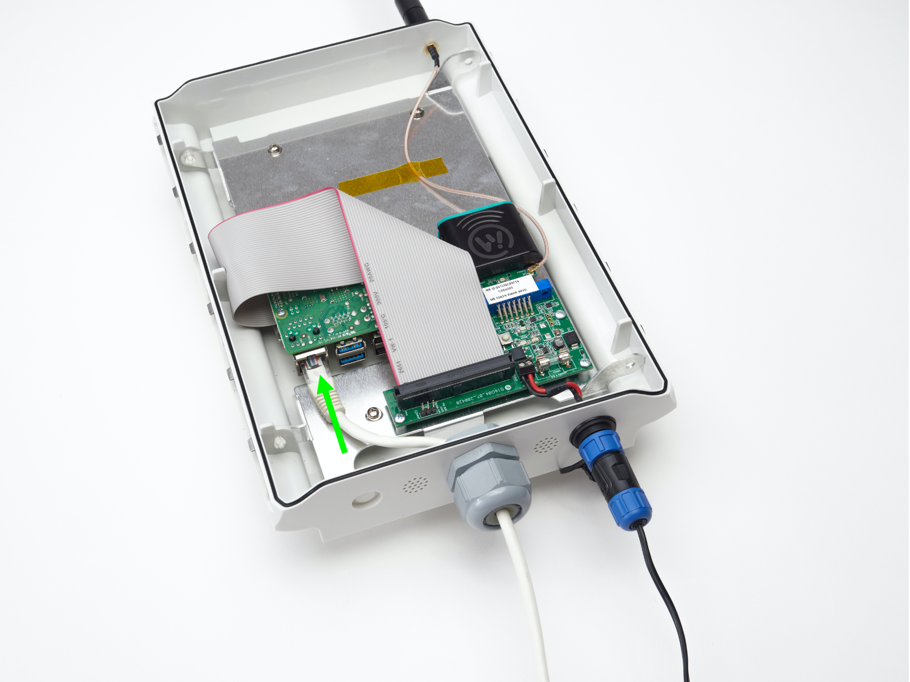
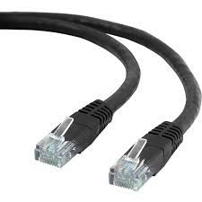
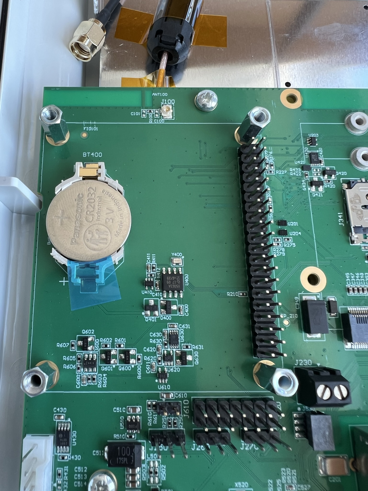
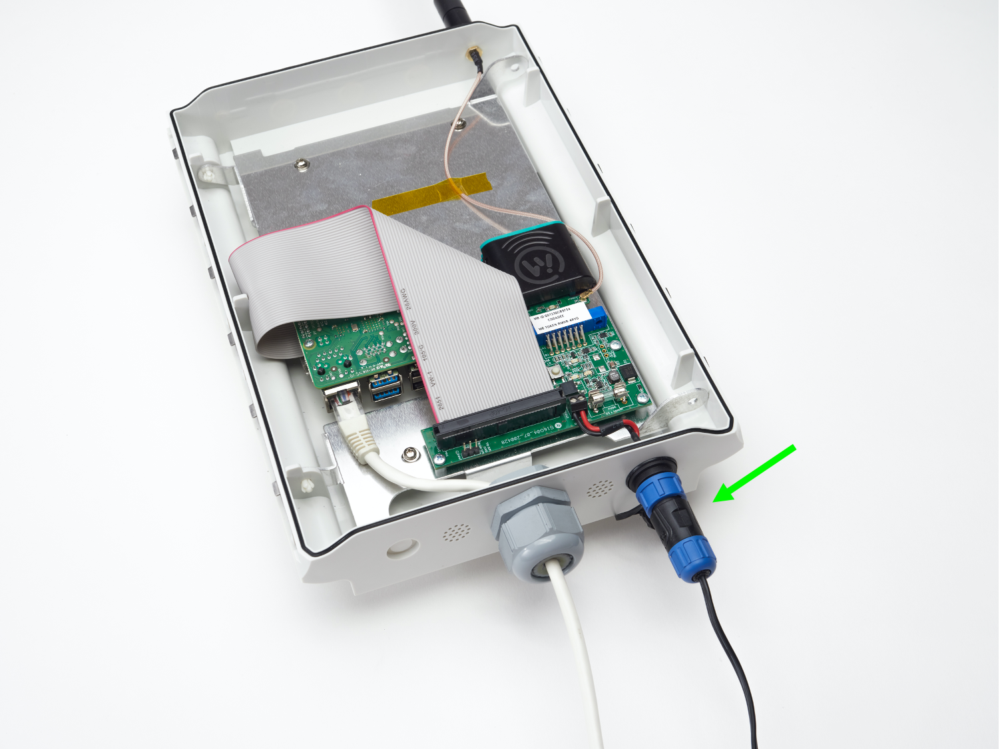

# Gateway Starting Guide

This page will help you set up your Gateway (read more about
the Gateway on [this page](products-gateway.md)).

## Set up your gateway

> **Important:** The Gateway is a *trusted device*. It must be located where
you have physical protection against malicious agents.

### Open your gateway

Press the two metal clips on the bottom of the casing as in shown in the picture below.

To assemble the gateway casing once again, please note that the side parts are
nonsymmetrical and need to be mounted on the correct side.

### Setup an Internet connection

Plug in an Ethernet network cable in the Gateway according to the
picture and connect the other end of the cable to your router or
switch. When the cable is connected, continue with the [Power the
Wittra Gateway](#power-the-wittra-gateway) step.

On the Unified Gateway:

On the legacy Gateway:

An ethernet cable:

> **NOTE**: The Ethernet cable is not included in your IoT Solution.

If your network is using DHCP for dynamic configuration of network
parameters then all you need to do is to attach an Ethernet cable. If you
require to set up a static IP address, netmask, gateway, etc. refer to
[Advanced Gateway Configuration](howto-advanced-gateway-config.md).

### Activate coin cell battery

The Unified Gateway (but not the legacy Gateway) has a real-time clock
on its board, powered by a coin cell. This enables consistent timestamping
even if the gateway loses power or reboots.

Activate the real-time clock by removing the transparent plastic band in blue
shown in the picture below:

### Power the Wittra Gateway

Connect the 12V Power Supply according to the pictures below. The 12V Power
Supply is included in the box. Wait 10 minutes for the Gateway to boot and start.

On the Unified Gateway:

On the legacy Gateway:

### Re-seal the Gateway

After you have verified that the gateway is connected to your local network you
can re-seal the gateway by putting the cover back on.

### Mount the antenna

Mount the antenna on top of the gateway. The antenna is included
in the box.