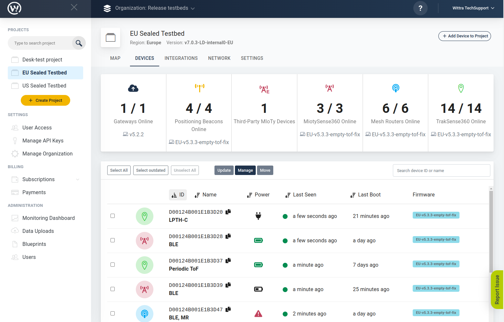

# Maintenance

Once your system is up and running you can monitor it from the Wittra portal's device view:

## System Update

Wittra releases new firmware for both the C{x}ameleon and the Unified Gateway
typically every few months. The releases are announced via email to all registered
users, and they are visible from the `Settings` view in the portal. Release notes
can also be found on [this page](resources-release-notes-system.md)

As general maintenance, we recommend you upgrade your system at every new general release.
This is to ensure you have all the latest security patches as well as stability fixes
and new features. Each release typically improves network performance, lifetime,
and capabilities. As a rule of thumb, an over-the-air upgrade of the full network
will consume about 1% of the device's battery capacity.

## Recharging Batteries

For all units that are not mains-powred or set up to harvest power (e.g. with the current meter),
you will need to recharge batteries periodically. For estimates of the C{x}ameleon's battery
life in different scenarios, see [this page](resources-system-capabilities.md).

You can spot devices with low battery in the device list:

Notes regarding charging of devices with a click-on sensor mounted:
* [LPTH](/products-lpth-lpthc.md). Remove the click-on, charge the C{x}ameleon then re-add the click-on.
* [LPTH-C](/products-lpth-lpthc.md). Connect the power supply to the LPTH-C click-on's micro-USB port,
and the C{x}ameleon will charge.
* [Battery pack](/products-battery-pack.md). The battery pack will extend the C{x}ameleon device's battery
life by a factor of about 4. The C{x}ameleon will report only one voltage value: the highest of the
internal and external battery voltages.
* [Current meter](/products-current-meter.md). The current meter embeds its own battery. It will
harvest power from the clamp and is therefore able to keep operating significantly longer
than a bare C{x}ameleon. You can monitor the internal voltage of the current meter
in the portal (device details panel). The C{x}ameleon will continue to run off the current meter
battery as long as there is enough energy to harvest.