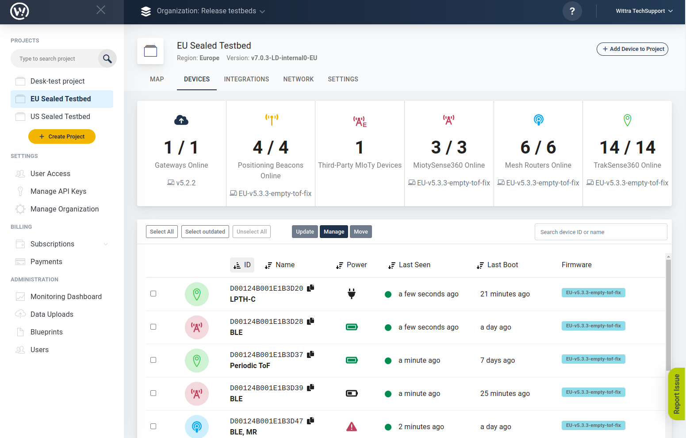
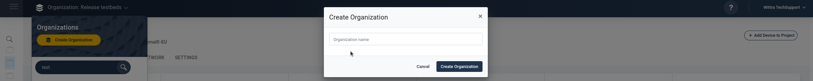
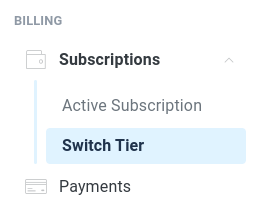
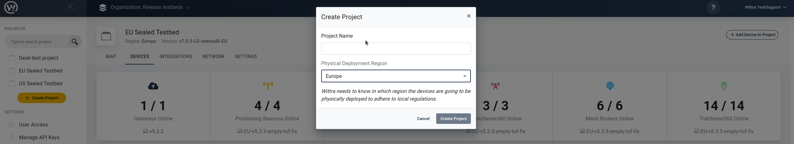
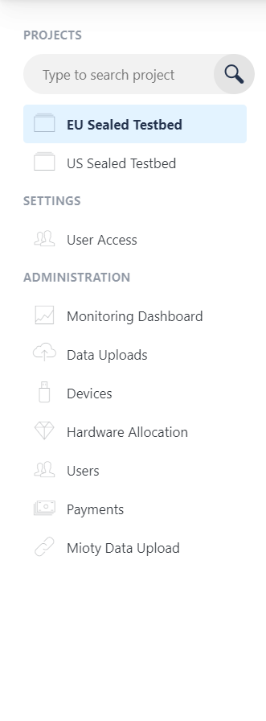
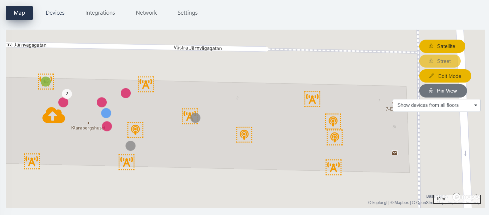
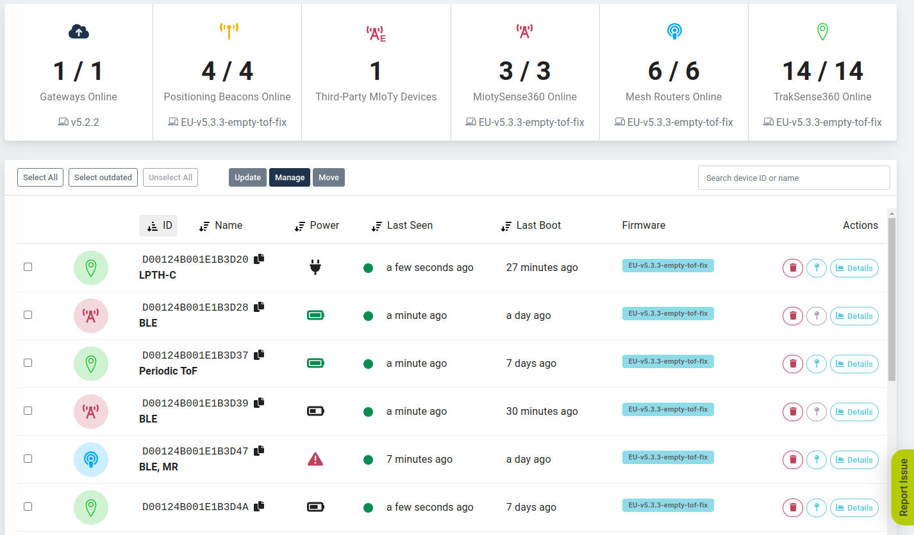

# The Wittra Portal

The Wittra portal provides a rich user interface for the administration and
maintenance of Wittra solutions. See below what a set up project looks like.

## Create a Project

To create a project, go to the [portal](https://portal.wittra.se) and follow
the instructions.
You should perform the following steps in the portal:

1. Set up an organization.

2. Activate a subscription.

3. Set up a project.

## Top bar

Indicates the name of the organization(s).
You can also search through the list using the search functionality.

On the top right, there is a `?` symbol with quick links to guides and walkthroughs.

On the very right you can find your account-related information.
Here you can edit your user profile information and log out of the portal.

## Side panel

On the side panel, you can see the list of projects that belong to the
current organization. You can also search for projects in the list using
the search functionality.

In Settings, it is possible to manage user access and permissions
tied to each user within the organization.

On the bottom left, there is an Administration menu where you can access
various settings at the organizational level.

## Project Dashboard

The Project Dashboard is where all the information related to the deployment is
displayed. The following sections will describe the functionality of each tab.

### Map

Here you can get an overview of the deployment on a map.
For further information, please have a look at [this page](howto-set-up-map.md)

### Devices

This view provides a list of devices that are added to your project.
You can filter them based on the types of devices by clicking on the checkboxes next to device IDs or device names.

Sometimes devices will appear offline in the Portal's device view.
The criteria for a C{x}ameleon to be considered as offline is based on the time since the last received data.
The timeout is calculated as 2.5 times "t", where "t" is the device’s lowest posting period.
Devices post statistics by default every 1h which means "t" is never more than 1h.

Examples:
* Device configured to post temperature every 5min => "t" is 5 min, timeout is 2.5 x 5 => 12.5 minutes
* Device configured to post temperature every 5min and humidity every 30min => "t" is 5 min (lowest period), timeout is 2.5 x 5 => 12.5 minutes
* Device configured to post temperature every 30min => "t" is 30 min, timeout is 2.5 x 30 => 75 minutes
* Device configured to post temperature every 2h => "t" is 60 min because statistics come every 60 min. offline timeout is 2.5 x 60 => 150 minutes

The exact rule above applies for all C{x}ameleon devices: WiTTRA Sense 360, MiotySense360, Mesh-Router, or Positioning Beacon.

#### Firmware

For each device, there is a field indicating which firmware version it is running. The firmware version could be highlighted in one of the following colors.

*  <b>Green:</b>  Device firmware is up-to-date with the system version for the project, and the system version is the most recent version.
* <b>Blue</b>: Device firmware is up-to-date with the system version for the project.
* <b>Blue, with a percentage</b>: The device is currently undergoing an automatic firmware update.
* <b>Yellow</b>:  Device firmware is outdated.

#### Last seen and Last boot

The gateway, WiTTRA Sense 360, and Mesh-Routers regularly indicate their
presence in the network.

In the [Project Dashboard](https://portal.wittra.se/) project view, the
time when a device last reported can be seen in the `Last Seen`
column. If the device report interval is within normal limits the device
is marked with a green indicator. If a device is disconnected or has left the
network, the indicator will turn gray.

Under the `Last Boot` column, the device reports the last time it re-started.

#### Data tab
For each WiTTRA Sense 360, you see all sensors' current values, and how it has changed between posts. We currently support the following sensors:

* Battery
* Temperature
* Usage (moving/stationary)
* Accelerometer
* Impact
* Magnetometer

#### Details and Update

The Details view for each device allows you to configure the device, see
[System Configuration](howto-device-configuration.md) for more information.

You can select which devices to manually update, see
[SystemUpdate](howto-system-update.md) for more information.

### Integrations

Here one can create an integration using Webhooks.
For further information, please have a look at [Integrations & API](howto-integrations-and-api.md).

### Network

The network tree visualizes the overall architecture of the mesh network,
depicting the link quality between the devices.
It is meant for use during the deployment of the system, as well as for monitoring.
For further information, please have a look at the [Deployment Guide](howto-deployment-guide.md)

### Settings

Here you can configure the System version (see [this page](howto-system-update.md))
and network settings.
You can also change the name of the project.
If you ever need to delete the project, you can do it here.
Note that this step is permanent, and hence, follow the warnings carefully.
