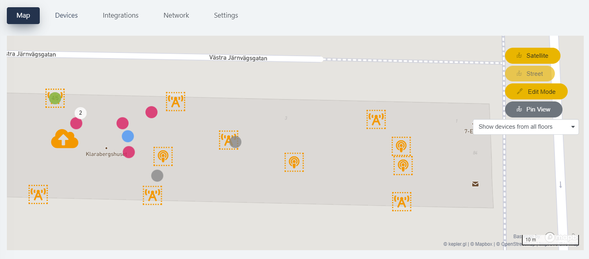

# Set up the Map

This guide will help you set up the system for positioning.
Before you start, be sure to plan your installation as per our [Deployment guide](howto-deployment-guide.md).

## Placing Mesh-Routers and Positioning Beacons

**Step 1.**
Go to the `Map` tab and click the *Edit mode* button on the right-hand side.

**Step 2.**
Choose the `Position Devices` in the menu to the right and click the Mesh-Router
and Positioning Beacons you want to position in the menu to the left.
Before you can place the device, you have to assign it to a floor level.
If you do not need to distinguish between floors, choose the default level 0.
Once you have placed the device, you can always right-click on it to
change the associated floor.

When the devices have appeared on the map, drag them to their true location.
To ensure higher accuracy, it is recommended to use a drawing (e.g. a floor plan of the site)
as a layer on top of the map. Learn more about layers in the [Floors](#floors) section.

**Step 3.**
WiTTRA Sense 360 devices will show up on the map on their derived position in the configured time frame of the WiTTRA Sense 360.

## Floors

**Step 1.**
Under the `Map` tab click the *Edit mode* button on the right-hand side and select *Floors*.

**Step 2.**
Choose the Floor to which you want to add your floorplan by clicking the Edit symbol.
Click *Select Floor Plan* and upload a file of your floorplan or site drawing, in JPG or PNG format. Save the file by clicking *Save*.

>**NOTE:** The floorplan has to have a known scale, so it can be fitted correctly on the map,
as the correct latitude and longitude of the Mesh-Routers and Positioning Beacons
are a vital input to the positioning algorithm.

**Step 3.**
Zoom into your site location on the map. Select your level on the left-hand side, and the floor plan will appear on the map.
Drag and drop the corners to fit the map, and check so the scale is the same as the map scale, visible in the bottom right.

**Step 4.**
Click *Exit Edit Mode* on the right-hand side menu. Choose the Floor in the drop-down menu labeled *Select Floor*.
