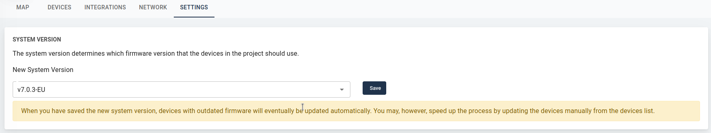
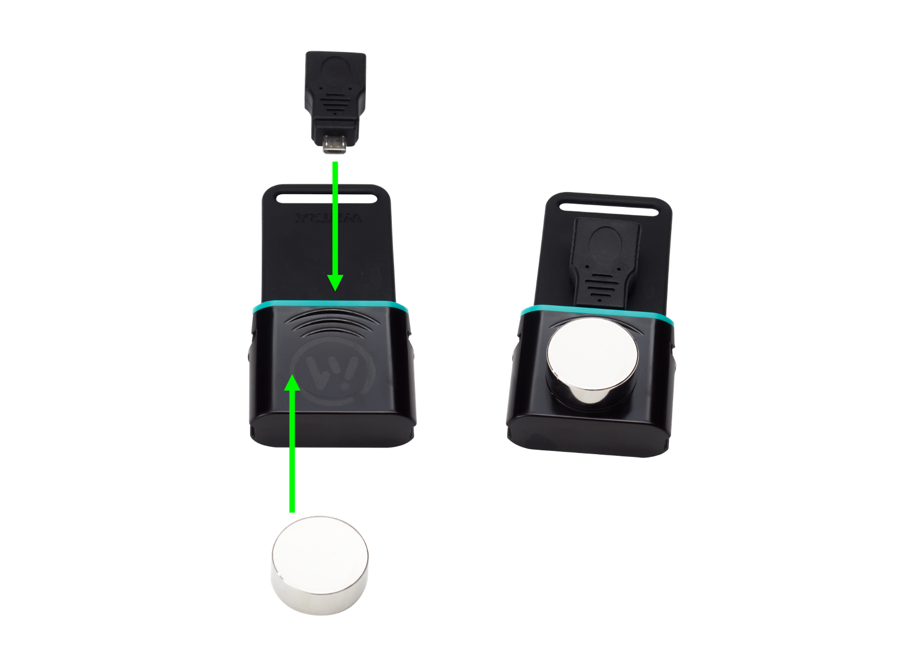

# IoT System Update

This page shows how to keep your Gateway and C{x}ameleon devices up-to-date with the latest security patches and new features.
We use the concept of *System Version* to identify a collection of firmware versions intended to work together, for all your devices.
To update to the latest system version, navigate to the `Settings` tab of your project.

An important note is that all binaries are signed by Wittra.
This applies to both the Gateway and C{x}ameleon firmware.
Read more on our [security page](technologies-security.md).

> When first setting up your system, be sure to update the Gateway and perform a
> manual update of every C{x}ameleon device.

## Gateway update

Once you select a new system version, the gateway will download its new firmware directly and apply it.
The LEDs (blue for gateway upgrade, red for border-router upgrade) will blink during the upgrade as described in the [Gateway page](products-gateway.md).

> **NOTE:** Do not power off the gateway while the LEDs are blinking, or have just stopped blinking. Instead, wait for the gateway to connect to the internet before powering off.

## C{x}ameleon automatic update

C{x}ameleon devices configured for 6LoWPAN (Mesh-Routers, Positioning Beacons, and WiTTRA Sense 360) will update automatically over the air.
This is a slow procedure, which can take between several hours and up to a day (due to low bandwidth and spectrum regulations).

> **NOTE:** The devices remain operational during the download, though
once they are ready to reboot you may experience a short disconnection.

> **NOTE:** MiotySense360 devices do not use 6LoWPAN, and as such, can only be updated manually.

## C{x}ameleon manual update

The manual update method is the faster one (about 3 minutes per device),
but is limited in range and requires manual intervention (reboot the device in manual update mode).

Manual updates are used in the following scenarios:
* First-time use of any C{x}ameleon device
* Update of MiotySense360 devices (automatic updates not available over Mioty)
* For project settings changes (PAN ID or security settings)
* Fast update of any C{x}ameleon device (manual updates are faster than automatic updates)

Follow the steps below:

**Step 1. Collect the devices**

Collect the devices you wish to update and place them close to the gateway.

**Step 2. Set the devices in update mode**

With the micro-USB port protection cover off, place the included
magnet on the device. It should be placed roughly in the area indicated by the
picture below. With the magnet in place, insert the OTG adapter into the
micro-USB port and then remove it again.

The device's LED should start advertising two short blinks followed by a
pause to indicate that it has entered manual update mode, after which a device
is ready to start the firmware download.

**Step 3. Start the update**

On your project's portal page, go to the `Devices` tab.
Select the devices you wish to update and click `Update`.
The devices will be updated in batches by the Gateway.
Their LED will blink fast for a few minutes before the device resets and joins the network.