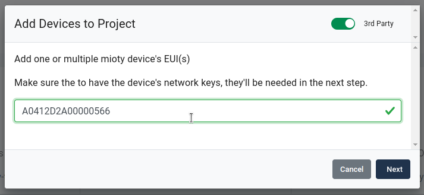
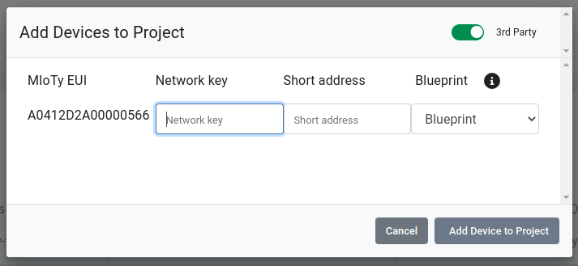
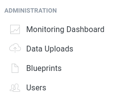

# Third Party Mioty Devices

With [Mioty](technologies-mioty.md), you can not only attach Wittra's
MiotySense360 devices, but also third-party devices.
Both will be able to post directly to the Wittra [Unified Gateway](products-gateway.md)
as long as it is equiped with a [Mioty HAT](products-mioty-hat.md).

The only constraint for third-party devices is that they use the standard frame format
with Mioty blueprints as payload. Before you start, be sure to collect the following
information (contact the third-party vendor):
* Device EUI: the unique device identifier.
* Network key: the Mioty network security key.
* Short address: the Mioty short address (2 bytes in hexadecimal representation).
* Blueprint: the standard JSON schema for Mioty payloads.

First, in the device view, click "Add Device to Project" and set the "3rd party" toggle.
Enter the device EUI:

Now you will be asked for more information: network key, short address, and blueprint.
The blueprint for your device might already be present in the system.
See below on this page a list of blueprints we already have in the system, for products we have tested.

If the blueprint is missing from the dropdown menu, you have the option to upload it yourself
to the portal.
Select "Blueprints" in the left panel and upload the device's JSON blueprint.

## 3rd Party Products Tested by Wittra

Below is a list of the products we have already tested in our system: connected
via our Unified Gateway and to our Portal and Webhook & API.

### Lansen
| Product | Note | Blueprint ID |
| ------- | ---- | ------------ |
| [LAN-MIOTY-E2-CO2](https://www.lansensystems.com/umbraco/surface/filestorage/file/3227) | CO2/Temp/Humidity | A0412D0920001100 |
| [LAN-MIOTY-E2-CO2-S-I](https://www.lansensystems.com/umbraco/surface/filestorage/file/4599) | CO2/Temp/Humidity/Sound | A0412D0920005401 |
| [LAN-MIOTY-C-TH](https://www.lansensystems.com/umbraco/surface/filestorage/file/4594) | Temp/Humidity | A0412D0920001201 |
| [LAN-MIOTY-M2](https://www.lansensystems.com/umbraco/surface/filestorage/file/4595) | Door/Window detector | A0412D0920005601 |
| [LAN-MIOTY-G2-LDP](https://www.lansensystems.com/umbraco/surface/filestorage/file/4597) | Water leakage detector | A0412D0920006101 |
| LAN-MIOTY-SMK2 | Smoke detector | A0412D0920005701 |

### Sentinum
| Product | Note | Blueprint ID |
| ------- | ---- | ------------ |
| [Appolon-ZETA](https://sentinum.de/apollon-zeta/) | Smart waste sensor | FFFFFFFFFFFFFFF0 |
