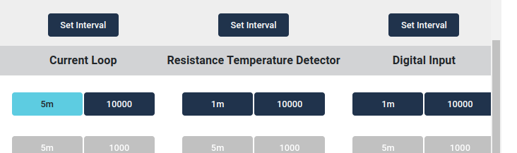

# 4-20 mA, RTD & Digital I/O


> Part number: `ADT-1.0`<br/>
> Datasheet: *coming soon*.

The Wittra ADT enables 3 different sensor capabilities along with a configurable digital output port (Upcoming feature).

* 4-20 mA: A current loop for all sorts of analog sensors
* RTD: Resistance Temperature Detector, for temperature sensing in extreme ranges via a remote probe
* Digital I/O: Any sensor or actuator with digital input and/or output

## Quick Start Guide

This is a guide to getting started with your Wittra ADT with instructions on how to connect external sensors and configure them.

### Step 1. Connect a power source to the ADT

There are multiple choices when it comes to powering the ADT:

- Power it from the internal battery of the [C{x}ameleon](products-cxameleon.md)
- Use an external power adapter
- Use an external [Wittra Battery Pack](products-battery-pack.md)
- Harvest power from the 4-20 mA loop (Upcoming feature)

> **NOTE:** Currently we recommend supplying external power with a power adapter for all ADT
> installs since battery savings features are not yet implemented.

### Step 2. Connecting ADT
ADT consists of two parts, the sensor and a removable terminal block to which the external sensors are connected.

> **NOTE:** Consult the data sheet of the external 4-20 mA sensor on how to connect them. Some sensors
> will need a power supply in series with the loop while others provide the power and can be connected straight to the ADT inputs.


1. Connect any external sensors to the ports of the terminal block, make sure they are well-connected
2. Click in the terminal block in the ADT
3. Connect any external power source, unless you want to power it from C{x}ameleon
4. Connect to C{x}ameleon via the micro usb connector on top and make sure that it clicks into place. You should see the LED on the C{x}ameleon blink once


### Step 3. Preparing Portal and C{x}ameleon for measurements



After you have connected the ADT to your device, you can go into the portal view and open the detailed view.

> **NOTE:** If the sections for the individual sensors are missing from the details view or the configuration view,
> you can try to disconnect the ADT from the C{x}ameleon and then reconnect it. The C{x}ameleon will then restart
> and reconnect to the network.

> **NOTE:** For MiotySense360, you need a manual update to apply any configuration change.

In the manage view there are two options for each of the sensors, the Posting Period and the Sampling Period.
The Posting Period decides how often the device will post a measurement, and the Sampling Period decides how often the ADT will sample the connected sensor. These settings affect the power consumption when running from a battery source. As a consequence the Posting Period and Sampling Period should be kept as low as possible to preserve battery life.
is needed, the posting period and Sampling Period should be kept only as low as needed.

The default setting is a 5 minutes Posting Period and a Sampling Period of 1000ms. Choosing the right period value depends on the use case and what external sensor is connected, if you are unsure then leave it unchanged.

### Interpreting the data

#### 4-20 mA Current loop


This sensor supplies 4 data points from the 4-20 mA loop in the range between 4000uA and 20000uA.

> **NOTE:** When nothing is connected to the sensor a value below 4000uA may be reported as pictured above. This can
> be interpreted as a failed connection or a fault in the loop. Some 4-20 mA sensors report lower values to signal
> special conditions.

- **Latest,** the most recent measurement.
- **Min,** the lowest measurement since the last post.
- **Max,** the highest measurement since the last post.
- **Average,** the average of all samples since the last post.

The number of samples that are used for the calculations depends on the Sampling Period set, as well as the Posting Period.

If we for example set a Sampling Period of 2000ms, and a Posting Period of 5 minutes the sensor will collect 150 samples
in between posts. With the default settings of 5min/1000ms periods, 300 samples are collected
and used for the min/max/average calculations.

The raw values that are measured must be scaled for the data to be interpreted correctly. Consult the data sheet of the
connected 4-20 mA sensor on how to properly interpret the output.


#### RTD, Resistance Temperature Detector

The RTD sensor gives the temperate readout from an external probe by measuring its resistance. As with the 4-20 mA sensor, the
raw measurement is given and must be converted depending on what sensor is connected. The measured values are
given in Centiohms (cΩ) and as with the 4-20 mA sensor, the latest, minimum, maximum and average values are given.

#### Digital Input

The digital input sensor enables a logic input that can be used to monitor digital signals, such as pulses coming from other
sensors.


Currently we support configuring the digital input as a pulse counter. This is done by enabling the sensor in the portal manage
view and choosing a suitable sampling period. There is also configuration options for edge triggering and debouncing that we can
adjust internally while setting up the project. These will be user-configurable eventually.


Since there is always a risk of losing counts, we have designed the counter in ways to minimize this. For this reason
the sensor will always give an absolute number of increasing counts after it has been connected to a device.

The count is stored in the C{x}ameleon device and not in the ADT sensor, so even if the ADT loses power or resets because of any
other reason, the telemetry is not reset. This ensures accurate measurements even though radio packets might be lost.

The count over time is calculated by comparing the first telemetry measurement with the latest, or any two measurements in a known
time frame.

Currently only the total number of counts is shown in the portal view, but telemetry will be added while we're developing
this feature.

##### Digital Input typical application with external relay


#### Digital Output

The digital output can be used to set external peripherals such as ventilation systems on and off, but without any
real-time capability. The response time is dictated by the configuration fetching period, which is set to 60 minutes
by default.

To set the digital output an API patch request to the config key `exts` has to be made.
Please see our [API documentation](resources-api-documentation) for further details on accessing the API.

The following patch to the config will enable digital out, with the key `o` taking a boolean set to true or false.

```json
{
    "exts": { "o" : <boolean> }
}
```

##### Digital Output typical application with external relay

The digital output acts as a switch and can be used directly with smaller loads or with a relay for any installation.


