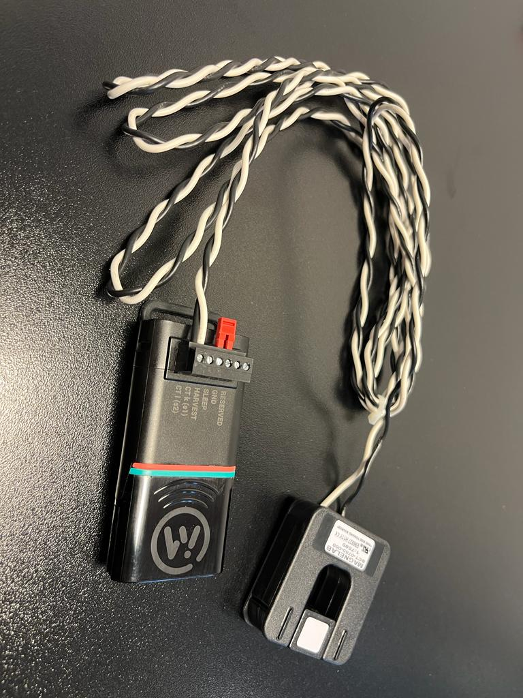

# Current Meter

> Part number: `AMPM-1P-1.0` 
> Datasheet: [`AMPM-1P-1.0`](datasheets/datasheet-current-meter.pdf ':ignore')

The Wittra Current Meter enables single-phase current metering.
A split core current clamp connected to the Current Meter measures up to 400 Amps AC current on the primary center conductor.
The clamp can be fitted around existing electrical wiring, rapidly reducing the installation time.
By harvesting energy from the current clamp, the Current Meter can run without any external power source.

> **NOTE:** To get the best performance for harvesting, it is recommended not to set sampling frequency lower than 60000ms (i.e. 1 sample per minute).

The Current Meter connects to a WiTTRA Sense 360 or MiotySense360 which posts measurement data to the cloud
over either 6LoWPAN or Mioty.

## Quick Start Guide
This is a guide to getting started with your Wittra Current Meter.

> **NOTE:** The black loop cable is "Transportation Safety". This is to keep the Current Meter in sleep mode during transportation and storage. See the image to get an overview of the connectors.

### Step 1. Charging your Current Meter
On receiving your current meter it is recommended to charge it for 2 hrs.
This can be done by connecting the provided battery pack or any micro-USB charger.

### Step 2. Preparing Portal and C{x}ameleon for current measurements
1. Set up your project and devices (see [Getting Started](/)).

> **NOTE:** If this is the first-ever current meter you add to this project, the "Currentmeter"
> section will be missing from the "Manage" view. In this case, proceed to Step 3,
> and get your device with current meter online in the Portal. You can then come back to Step 2.

2. Configure your device for current measurement
   1. Select the device you want to use with Current Meter and go to manage view.
   

   2. In the manage view, set the interval by following the sequence (1-2-3-4) as shown in the image below.
   (You can optionally set event-based measurements by following Steps 5 and 4).
   

> **NOTE:** For MiotySense360, you need a manual update to apply any configuration change.

### Step 3. Connecting Current Meter
Once the current meter is charged it is time to set it up.
1. Connect the current clamp on the current meter

1. Click-on in the Current Meter on the C{x}ameleon

1. Remove the transportation safety and start measurement.

1. In the portal verify that the Current meter is detected and posting values.

Then scroll down to see the Currentmeter card

### Step 4. Fix the Current Clamp and Observe Data in the Portal
1. Once the Current Meter is readied, mount the current clamp around the cable you want to measure.

2. Goto Details view to view incoming current measurement data in the portal.

## Interpreting the Data
The current meter samples every X seconds (depending on the settings in manage) and sends a consolidated data package in each measurement interval (Same as the posting period as set in the configuration).
Each data package consists of 3 data points.
- min (Minimum measured amps in the measurement window)
- max (Maximum measured amps in the measurement window)
- average (Average measured amps in the measurement window)

As a user, you can use the average field to calculate power consumption during the last measurement interval.

Although we cannot see spikes (yet) you can observe load fluctuations by looking at the min-max values.