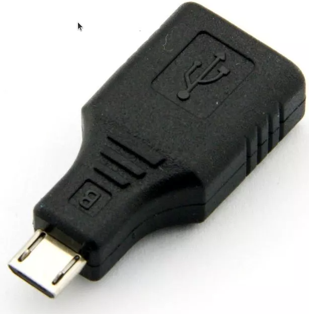

# C{x}ameleon

> Part number: `CXAMELEON-1.1` 
> Superseded part numbers: `CXAMELEON-1.0`, `MESHROUTER-1.0`, `SENSORTAG-1.0` 
> Datasheet: *to be added*. Older: [`MESHROUTER-1.0`](datasheets/datasheet-mesh-router.pdf ':ignore'), [`WiTTRASENSE360-1.0`](datasheets/datasheet-wittra-sense-360.pdf ':ignore')

The C{x}ameleon is a flexible product that can be configured as either:
* a Mesh-Router (extends wireless range)
* a Positioning Beacon (enabled positioning)
* a WiTTRA Sense 360 (tracking and sensing device)
* or a MiotySense360 (long-range LPWAN sensing device)

You will be able to configure your C{x}ameleon devices when you first register them, or at a later point if you need to.
Older products (labeled `MESHROUTER-1.0`, or `SENSORTAG-1.0`) are now also re-configurable like the C{x}ameleon is.

You can learn more on the different device types on [this page](products-wittra-solution.md).

## Powering your devices

The C{x}amaleon is shipped with low batteries, so before you start,
make sure you either power or charge the devices.
Note that Mesh-Routers must be powered at all times.
Positioning beacons can operate either on mains or with an external battery attached.
WiTTRA Sense 360s and MiotySense360s are designed to run on > 1-year internal battery.

This is how you power or charge a device:
1. Unmount the protection cover with your hands or by using the accompanying
   release key from the box according to the pictures below. Place the release
   key in front of the device and push it towards it. The protection cover
   will be pushed up and can now be removed.

2. Connect the Power Supply Unit 5V. The Power Supply
   Unit 5V is included in the box.
3. The first initial charging time is approximately 3 hours.

## LED indicators

* **Two quick blinks.** The device has rebooted.
* **Periodic double-blinks.** The device is ready to be manually updated.
* **Continuous blinking.** The device is being manually updated.
* **Pulsing.** The device is charging. The LED will turn off when charging completes.

## Reseting a device

Use the OTG adapter included in the kit to plug into the micro USB
connector at the top of the device, you should see two quick blinks
which indicates that the device has rebooted and the OTG adapter can
be unplugged.

## Device orientation

The axes provided by the `accelerometer` and `magnetometer` fields can be interpreted in the following picture.

For example, if the WiTTRA Sense 360 is lying like the picture shown above, the
accelerometer should report a Z value of ~1 g, due to the floor pushing
up on the WiTTRA Sense 360 with a force matching the gravitational pull to the
center of the earth.

## Internal Sensors

The internal sensors available are:
* Temperature.
* Accelerometer: x, y, z acceleration value. Can for example help spot which side of the device is facing down (constant acceleration of 1g)
* Usage: percentage of time spent moving, per sampling window. Built on an accelerometer.
* Impact: configurable event on acceleration threshold, with option to filter per axis.
* Magnetometer: can be used to indicate which side of the device is pointing North.

## Click-on sensors

The C{x}ameleon can be limitlessly extended with external "click-on" sensors!
See for example our [environmental sensor](products-lpth-lpthc.md),
[current meter](products-current-meter.md) or [battery pack](products-battery-pack.md).

See below how multiple click-ons can even be stacked together! (In this instance:
LPTH-C environmental sensor together with battery pack)

> **NOTE:** To reset a C{x}ameleon device with a click-on mounted, simply unmount
> then remount the click-on.
