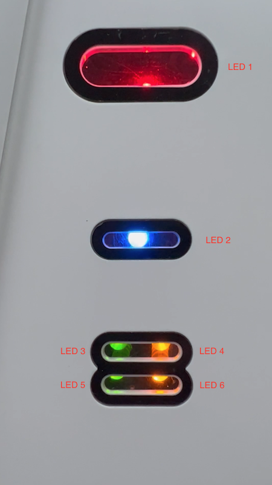
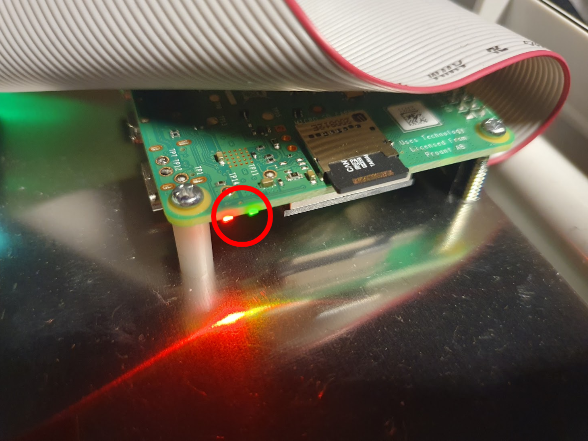

# Unified Gateway

> Part number: `UNIFIED-GATEWAY-1.0` 
> Superseded part number: `GATEWAY-1.0` (also referred to in this document as "Legacy Gateway") 
> Datasheet: [`UNIFIED-GATEWAY-1.0`](datasheets/datasheet-unified-gateway.pdf ':ignore'), [`GATEWAY-1.0`](datasheets/datasheet-gateway.pdf ':ignore')

The Wittra Unified Gateway (`UNIFIED-GATEWAY-1.0`) lets you connect IoT devices to the
Wittra portal. Both C{x}ameleon devices or third-party devices. The Unified Gateway
supports two wireless technologies as of today: 6LoWPAN and Mioty.

The older Gateway (`GATEWAY-1.0`) was 6LoWPAN-only.
It is documented on this page along with the Unified Gateway.

## Setup

To set up the Gateway, visit [this page](howto-gateway-setup.md).

## Advanced Configuration

For advanced configuration, visit [this page](howto-advanced-gateway-config.md).

## Update

To learn how to update the Gateway, visit [this page](howto-system-update.md).

## LED Indicators
### Unified Gateway (`UNIFIED-GATEWAY-1.0`)

The Unified Gateway has six LED indicators:

This Table depicts the Unified Gateway's six LED indicators:
<!-- prettier-ignore -->
| LED No. | LED Color | Blink pattern| Status|
| --- | --- | --- | --- |
| 1 | Red | Blinking at 4Hz (4 times per second) | The Border-router (internal 6LoWPAN component) is performing firmware update. |
| 2 | Blue | Blinking at 4Hz (4 times per second) | The Unified Gateway is performing firmware update. |
| 3 | Green | Steady on | The Unified Gateway is powered. |
| 4 | Yellow| Steady off| The Unified Gateway is not connected to any network. (There might be a link-local connection, but no IP address has been acquired) |
| 4 | Yellow | 1 short blink and then 1 second off | The Unified Gateway has connected to the local network but has not yet verified that there is Internet access. |
| 4 | Yellow | Steady on | The Unified Gateway has connected to the network and was also successful in accessing the Internet. |
| 5 | Green | Steady on | The Unified Gateway is using Ethernet on 1Gbit or 100Mbit Link. |
| 6 | Yellow | Very fast blinking | The Unified Gateway has ongoing activity on the Ethernet. |

### Legacy Gateway (`GATEWAY-1.0`)

The Legacy Gateway utilizes two LED indicators embedded in the Raspberry Pi:

This Table depicts the Raspberry Pi's two LED indicators:
<!-- prettier-ignore -->
| LED Color | Blink pattern| Status|
| --- | --- | --- |
| Red LED |Steady on| The Gateway is powered. |
| Green LED| Steady off| The Gateway is not connected to any network. (There might be a link-local connection, but no IP address has been acquired) |
| Green LED |1 short blink and then 1 second off | The Gateway has connected to the local network but has not yet verified that there is Internet access. |
| Green LED |Steady on| The Gateway has connected to the network and was also successful in accessing the Internet. |
