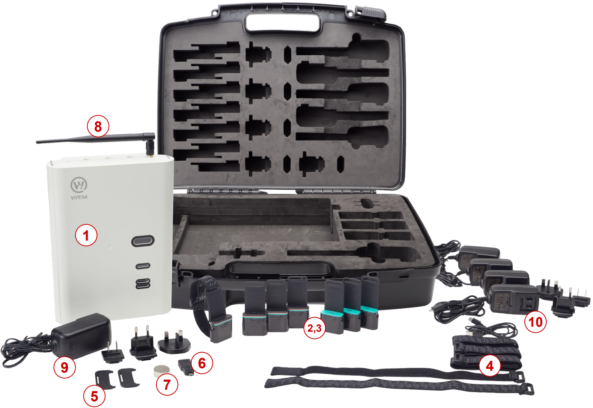

# IoT Out of the Box

> Part number: `UNIFIED-IOTNETWORKKIT-1.0-EU` 
> Superseded part number: `IOTNETWORKKIT-1.0` 
> Datasheet: [`UNIFIED-IOTNETWORKKIT-1.0-EU`](datasheets/datasheet-unified-iot-out-of-the-box.pdf ':ignore')

The WiTTRA IoT Out Of The Box is a starter kit that lets
you set up a project with a Gateway and a few devices
from the [Wittra IoT solution](products-wittra-solution.md).

## Contents

Your kit contains the following:

| Item | Qty | Item | Qty |
|-|-|-|-|
| #1 - Unified Gateway | x1 | #2 - C{x}ameleon | x8 |
| #3 - Cradle  | x8 | #4 - Velcro strap | x8 |
| #5 - Release Key | x2 | #6 - USB OTG adapter | x1 |
| #7 - Magnet | x1 | #8 - External Antenna | x1 |
| #9 - Power Supply Unit 12V | x1 | #10 - Power Supply Unit 5V | x4 |
| #11 - Cable gland m25x1.5| | #12 - C{x}ameleon stickers | x8 |

See picture below with the item numbers linked from table above
(note: the picture reflects a slightly older version of the kit,
with a few discrepancies from table above. The table
reflects the latest version).

You can find documentation on the [Unified Gateway](products-gateway.md), on the [C{x}ameleon](products-cxameleon.md), as well as a variety of click-on sensors.

To get started, go to [this page](/).