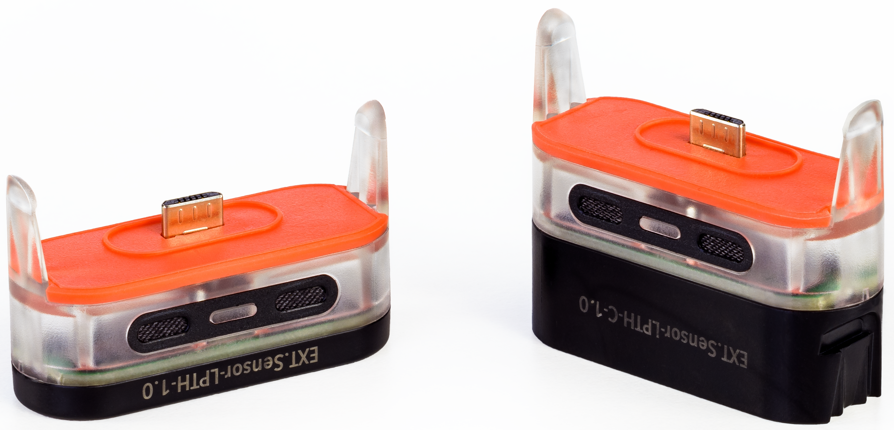

# Environmental Sensors

> Part number: `LPTH-C-1.1` and `LPTH-1.0` 
> Superseded number: `LPTH-C-1.0` 
> Datasheet: [`LPTH-C-1.1 + LPTH-1.0`](datasheets/datasheet-lpth-lpth-c.pdf ':ignore')

The LPTH click-on stands for Light, Pressure, Temperature & Humidity, and more specifically it enables:
* Light: ambient light sensing.
* Pressure: barometric pressure.
* Temperature: higher precision than C{x}ameleon built-in temperature sensor.
* Humidity: relative humidity.

The LPTH-C is an LPTH with micro-USB relay.
It enables external charging or stacking of further click-ons.
For weatherproofness, the LPTH-C requires either a lid or another weatherproof click-on stacked on top.

To use the environmental sensors, simply click them on a [C{x}ameleon](products-cxameleon.md) devices
then [configure your devices](howto-device-configuration.md) to post the data you are interested in.

See below a C{x}ameleon with LPTH mounted:

And a C{x}ameleon with LPTH-C mounted:

