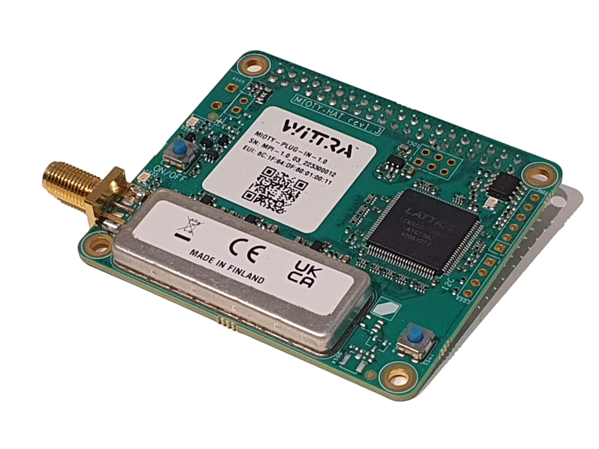

# Mioty HAT

> Part number: `MIOTY-PLUG-IN-1.0` 
> Datasheet: [`MIOTY-PLUG-IN-1.0`](datasheets/datasheet-mioty-hat.pdf ':ignore')

The Mioty HAT is a plug-in for the [Unified Gateway](products-gateway.md).
It adds Mioty connectivity to your system along with the existing 6LoWPAN.
This lets you connect the [C{x}ameleon](products-cxameleon.md) over long distances in one single wireless hop.
Additionally, you will be able to use third-party Mioty sensors, to suit the needs
of any applications.

## Setup

> **NOTE:** The Mioty HAT requires a Unified Gateway (can not be used with a Legacy Gateway).

The Mioty HAT is interfaced with the Unified Gateway via its 40-pin GPIO header
and SMA connector. *More details on mounting coming soon!*

To connect your C{x}ameleon over Mioty, simply set it up as a MiotySense360 devices
(either at [registration](howto-device-registration.md) or at any later point as a [configuration](howto-device-configuration.md)).
Always proceed to a manual update after setting up or configuring a MiotySense360 (the device has no downlink, and as such
can only be configured via a manual update).

## Learn more

For more information about Mioty, visit our [Mioty page](technologies-mioty.md).

