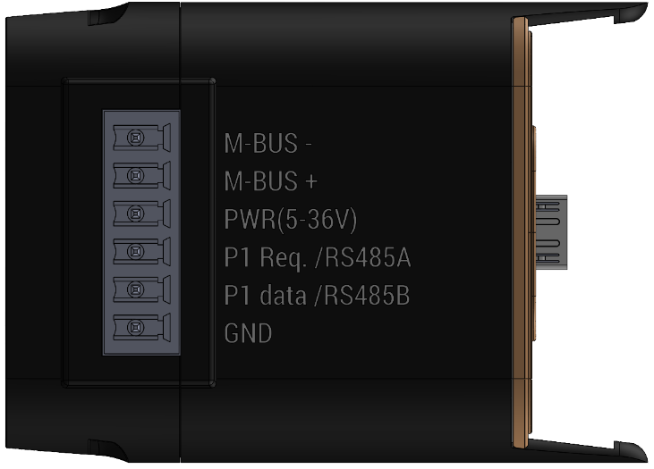

# Modbus & HAN Port Click-on

> Part number: `COMMBUS-1.0` 
> Datasheet: *coming soon*.

The CommBus will provide a Modbus and HAN Port interface to the C{x}ameleon.
This will bring a wide range of metering products into the Wittra ecosystem.
As it is simply a click-on device, it can be used on any Wittra network,
whether 6LoWPAN or Mioty.
