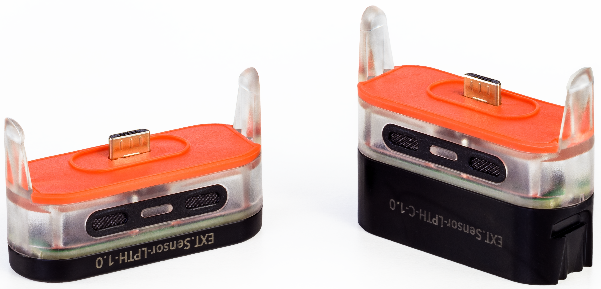

# The Wittra IoT Solution

The Wittra IoT Solution can help you connect, sense, and connect assets in
any environment, with applications ranging from [airports](https://www.wittra.io/iot-for-airports/),
[construction](https://www.wittra.io/use-cases/construction/),
[agriculture](https://www.wittra.io/use-cases/agriculture/),
[mining](https://www.wittra.io/use-cases/mining/),
[marine](https://www.wittra.io/use-cases/marine/),
[medical](https://www.wittra.io/use-cases/medical/),
to [industry](https://www.wittra.io/use-cases/industry/).

In a nutshell, a Wittra IoT system is composed of:
* A project in the [Web Portal](howto-portal.md)
* [A Gateway](products-gateway.md): connects the wireless devices to the Internet
* [C{x}ameleon devices](products-cxameleon.md): wireless tracking and sensing

The Wittra Unified Gateway combines multiple wireless technologies in one system:
* [6LoWPAN](technologies-6lowpan.md): mesh networking, tracking, and low-power sensing
* [Mioty](technologies-mioty.md): long-range, low-power sensing

The system can perform asset tracking via a combination of multiple [positioning techniques](technologies-positioning.md):
* RSSI: low-power, frequent updates
* ToF: high penetration and robustness
* *Coming soon*: high precision positioning with UWB

As for [sensing](technologies-sensing.md), we offer the following options:
* C{x}ameleon built-in sensors
* Wittra click-on sensors for the C{x}ameleon
* Third-party Mioty devices
* *Coming soon*: third-party sensor via analog interfaces (4-20mA, RTD) and digital interfaces (Modbus, HAN).
Available on both 6LoWPAN and Mioty

It is possible to build your own application via our [Integrations and API](howto-integrations-and-api.md).

## Wittra IoT Devices

The different devices in a Wittra system are:
- **The Unified Gateway** is the link between the wireless network and the Internet. It
is mains-powered and communicates securely with both the IoT devices
and the cloud. Inside the Gateway resides a component called the Border Router,
in charge of all wireless communication within the IoT network.
- **C{x}ameleon - Mesh-Routers (MRs)** are wireless range-extenders. They relay data wirelessly
over the mesh network. They are also used as an anchor for RSSI positioning.
They are always-on, and as such, require external power.
- **C{x}ameleon - Positioning Beacons (PBs)** are used as anchor for both RSSI and Time-of-Flight
positioning. They use less power than Mesh-Routers and are therefore viable for use
with an external battery.
- **C{x}ameleon - WiTTRA Sense 360s** are battery-powered sensors that can be positioned using
RSSI (against Mesh-Routers and Positioning Beacons) and/or Time-of-Flight
(against positioning beacons).
- **C{x}ameleon - MiotySense360s** are battery-powered sensors that can communicate over
long-range wireless Mioty links directly to Unified Gateways.

The Wittra product suite includes the devices above and more, including
click-on sensors and accessories.
A great starting point is our [IoT out of the Box kit](products-iot-out-of-the-box.md),
which gets you rolling with a Gateway, multiple C{x}ameleon devices and accessories.

