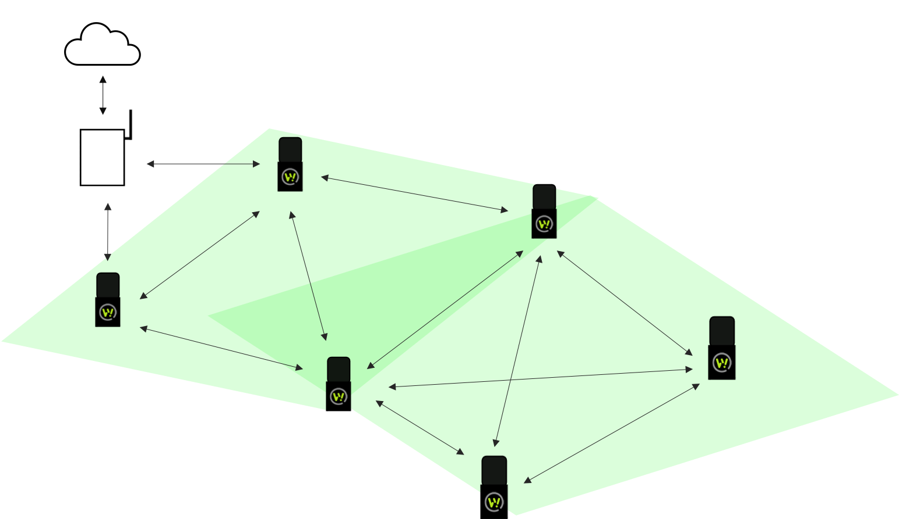
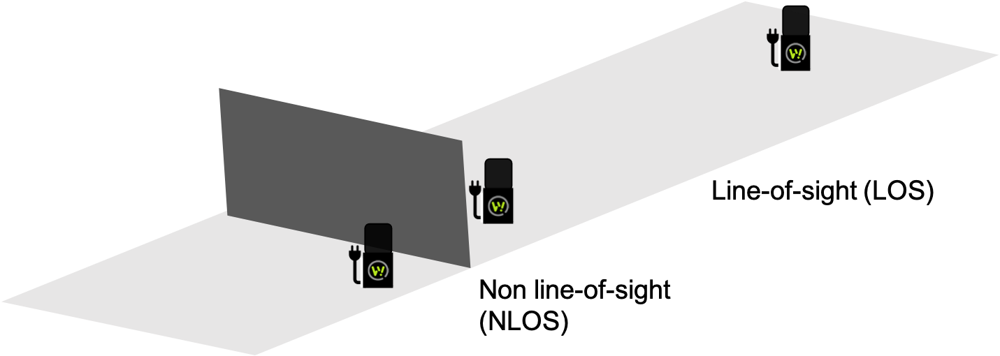

# 6LoWPAN

The Wittra IoT solution supports 6LoWPAN as one of the wireless technologies.
The standards involved mean that we can build the product on well-proven technology and that it can integrate into existing ecosystems.
* **IEEE 802.15.4.** At the radio access layer, IEEE 802.15.4 provides 50 kbps connectivity over subGHz frequencies (both 868 MHz and 915 MHz) at low power.
* **Wi-SUN.** Over IEEE 802.15.4 comes Wi-SUN, providing regulatory-compliant frequency hopping across multiple regions (EU & US). Frequency hopping is key in achieving robust communication regardless of the interference profile of any deployment.
* **6LoWPAN.** At the network layer, IETF 6LoWPAN equips devices with IPv6 Internet connectivity. This is achieved via online compression and fragmentation, adapting IPv6 to the challenging requirements of low-power wireless links.
* **RPL.** IETF RPL builds a mesh network where wireless mesh routers can extend connectivity beyond that of a single radio link. The protocols are self-healing and hence suitable for deeply embedded applications.
* **DTLS.** For security, IETF DTLS establishes end-to-end AES encryption and authentication. As a result, this provides confidentiality and integrity to all sensor and position data posted to the database. DTLS is an Internet-class, state-of-the-art security protocol.
* **CBOR.** Finally, application data is represented as IETF CBOR, a compact binary format now widespread in Internet of Things scenarios.

## Mesh Network (6LoWPAN and RPL)

In a mesh network, data can be routed from one node to another to reach the
end destination (in our case a gateway).
By using a mesh network we extend the range of a network further than one
single hop. Mesh networks are self-healing and redundant in the sense
that data can be re-routed when nodes fail along the path.
We currently support networks with up to 600 devices.

In our 6LoWPAN mesh network we have WiTTRA Sense 360, Mesh-Routers, Positioning Beacons,
 and the gateway.

- A WiTTRA Sense 360 is a battery-powered leaf node in the mesh network.
It collects sensor data and positioning information (RSSI and/or
Time-of-Flight), posts these to the cloud via the gateway, and goes
back to sleep.
- A Mesh-Router has the main purpose of forwarding data packets,
which is useful for range extension. Additionally, it can be used as
an anchor for RSSI positioning. Mesh-Routers are always-on and listening
for data to forward and for positioning probes.
- A Positioning Beacon is an anchor for both RSSI and Time-of-Flight
positioning. It is always listening for positioning probes but is able
to sleep 85% of the time while doing so.
- The gateway (more specifically: the border-router inside it)
is the end destination of data packets in a mesh network (secured with DTLS).
The Gateway then sends the data up securely, via HTTPS, to our backend.

## Frequency Hopping (Wi-SUN)

Our solution operates in the sub-GHz frequency band and uses Wi-SUN Frequency
Hopping (FH) for increased reliability. The devices switch frequency several
times per second, to mitigate the impact of any individual bad channel.
When a transmission fails on a bad channel, new attempts will be performed
over different channels, increasing the likelihood of eventually succeeding.

Note that the Sub-GHz band is much less prone to interference than the 2.4 GHz band since there are fewer products on the market that uses this spectrum, and at the same time government regulations impose limits on the radio usage per device.
However, interference still exists and that is why FH is key to building robust
networks.

## Expected range (IEEE 802.15.4g)

The radio in Wittra devices runs Sub-GHz (868 or 915 MHz) at 50 kbps in the
industrial, scientific, and medical (ISM) frequency band. By communicating in
this frequency domain you have a better range than for example the higher
frequency band of 2.4 GHz. You also have a better penetration meaning you can
communicate in harsher radio environments such as construction sites and in
cities, where line of sight is not an option.

The expected range of the system depends if you have line of sight or
non-line of sight and how high up you can put the Mesh-Routers. But on
average the range is around 100-200m.

## Relevant Pages

* Visit the [Unified Gateway](products-gateway.md) page.
* See our [deployment guide](howto-deployment-guide.md) to plan your 6LoWPAN network.
* [Register](howto-device-registration.md) your devices (as WiTTRA Sense 360, Mesh-Router, and Positioning Beacons) (or [configure](howto-device-configuration.md) them at a later time)
